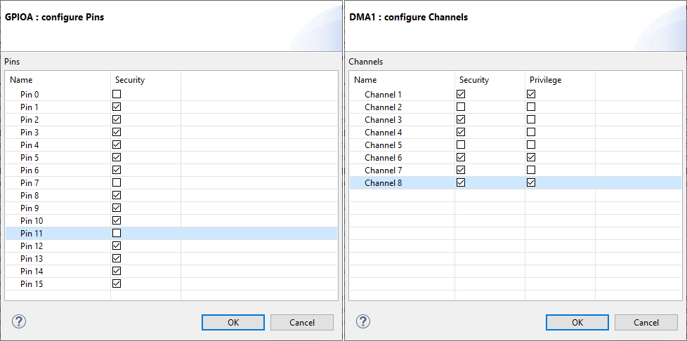
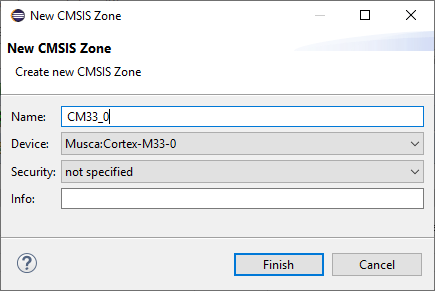

# Interactive Mode {#zTInteractiveMode}

The following section explains the interactive mode of the CMSIS-Zone Utility.
The following steps are explained:

 - \ref zTUICreateProject that allows to manage system resources.
 - \ref zTUIMemPerRes allows to create sub-memory regions and defines properties such as access permissions.
 - \ref zTUIZonePart that assigns available resources to sub-projects or execution compartments.
 - \ref zTUIGenerate for device configuration and linker settings.

## Create a CMSIS-Zone Project {#zTUICreateProject}

Go to **File** - **New** - **Project** and select **CMSIS** - **CMSIS-Zone Project**:

Click **Next**. In the next window, enter a **Project name**:

Click **Next**.

### Variant 1: Using an existing *.rzone file {#zTUICreateProjectVar1}

In the next window, select **Use existing resource file (\*.rzone)** and browse to the location of the
*.rzone file:

Click **Finish**. The new project is created and an empty \*.azone file is added.

### Variant 2: Using the SVD file from the device family pack {#zTUICreateProjectVar2}

In the next window, use **Select device to create resource file from device description**:

Next, select your device from the list of installed device family packs:

Click **Finish**. The new project and the *.rzone file are created and an empty *.azone file is added.

\note
Make sure that you have set the path to your pack installation directory correctly. Go to **Window** -> **Preferences** and check the entry for the **CMSIS Pack root folder** (usually set to `%localappdata%\\Arm\\Packs`:

## Memory and Peripheral Resources {#zTUIMemPerRes}

The available memory can be further divided into \ref zTUIMemAdd "smaller regions" that are later assigned to zones, for example a zone for loader and zone for application.

For memory and peripherals \ref zTUIPerProp "properties" such as access permission, privilege, and security level can be configured.

These settings can be for example used to generate source code files that configure the device at run-time.

### View memory and peripheral resources {#zTUIMemView}

Initially, this uses the information in the *.rzone file which defines the generic access permissions for memory and peripherals. The CMSIS-Zone Editor shows the **Resource Map** of the given device:

Here, you can see all resources that are available on the device. You see **Memory**, **Peripherals**, ** Cores**, and **Info** related to the resources. \ref zTGUIZoneEditor "Colored resources" are assigned to a zone.

### Create Memory Regions {#zTUIMemAdd}

To create a new memory region, right-click on the memory that you want to divide and select **Add memory region**:

In the dialog a name derived from the parent memory region is provided. Change this region name as needed and specify the size. In this dialog, you change permissions, privilege, or security level for the memory region. When done, click **Finish**:

The new memory region is immediately shown in the zone map. Depending on the security level, you may be able to assign this new region only to certain zones. For example, secure memory regions cannot be assigned to a non-secure zone.

The information about the memory regions is stored in the \ref xml_amemory element of the *.azone file.

### Delete Memory Regions {#zTUIMemDel}

To delete a memory region, right-click on the memory region select **Delete memory region**:

### Resource Properties {#zTUIPerProp}

To change the properties of a resource, such as a peripheral for example, right-click the resource and select **Properties**:

Then, you can set these properties:

**General**
 - `Shared`: the resource can be accessed by more than one zone
 - `Startup`: locate the vector table to this region
 - `No zero init`: preserve RAM content at startup
 - `DMA`: enable direct memory access

**Permissions**
 - `peripheral`: mark this as a peripheral
 - `read`
 - `write`
 - `execute`

**Privilege**
 - `not specified`
 - `privileged`
 - `unprivileged`

**Security**
 - `not specified`
 - `non-secure`
 - `non-secure callable`
 - `secure`

The information about the peripherals is stored in the \ref xml_aperipheral element of the *.azone file.

### Configure peripheral slot access rights {#zTUIPerSlotConf}

Peripherals can have so called slots that can be configured separately. Depending on the peripheral, the slots have different names in the Zone Editor. For example, for DMA they are called **Channels**:

For GPIOs, they are called **Pins**:

In the dialog, you can set security and privilege levels:

The information about the slots is stored in the \ref xml_aslot element of the *.azone file.

## Zone Partitioning {#zTUIZonePart}

Every CMSIS-Zone project consists of one or more zones. The basic flow to create zones is as follows:
 - In case of multi-core devices, create a zone for each processor.
 - Then create at least one zone for each processor to be able to assign memories and peripherals. If your device contains
  Arm Cortex-M cores supporting TrustZone for Armv8-M, create a secure and a non-secure partition for each of these cores.

### Create Zones {#zTUICreate}

To split a multi-processor system into single-processor sub-systems, you need to create new zones. Switch to the **Zones** tab and click the **Add new zone** button: ().

In the new window, you need to specify a name for the zone, select the applicable core, and choose the security level (secure/non-secure).

In the \ref zTEMuscaA1 "Musca-A1" example, a new zone called "CM33_0" was created and attached to processor core 0 without any security attribute (not specified):

Similarly, an additional zone called "CM33_1" was created and attached to processor core 1, without security attribute.

Save your settings with the **Save** button ().

\note
Adding zones only works for the currently opened \ref azone ".azone" file.
The information about the zones is stored in the \ref xml_zones element of the *.azone file.

## Generate output files {#zTUIGenerate}

The CMSIS-Zone utility can generate files that represent the configuration of the system. These files can be used in the project source files or tool configuration files.

other toolchains for further development. The generator process creates:
 - Configuration files for tool and hardware setup, that are defined by \ref GenDataModel ".ftl files" in the project `ftl` directory.
 - Files that represent \ref  zTUICreate "sub-systems" (\ref rzone ".rzone" and \ref azone ".azone") that can be partitioned further (restart the process).

To start the generation, press the **Generate** button or use the menu item **CMSIS Zone - Generate** ().

Check \ref zTProjEx to observe the changes. In the project, the generated `.azone` and `.rzone` files appear and the `ftl_gen` directory contains the files defined by the `ftl` template files:

