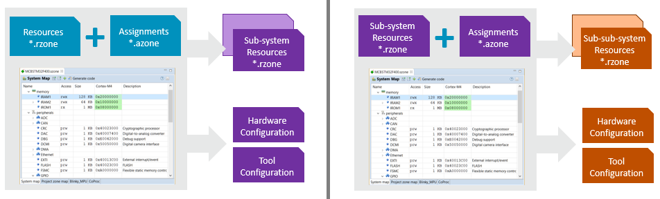
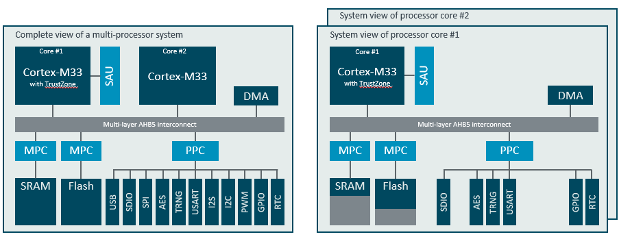

# Introduction {#mainpage}

## Overview {#Overview}

Embedded systems frequently integrate specific hardware for access protection or system isolation. For example, a Cortex-M33 processor based system may incorporate:
 - SAU (Secure Attribute Unit) to create a secure execution partition with controlled access from a non-secure execution partition.
 - MPC (Memory Protection Controller) to control the system-wide access permissions to memory.
 - PPC (Peripheral Protection Controller) to control the system-wide access permissions to peripherals.
 - MPU (Memory Protection Unit) to create execution compartments and protect other system parts from illegal access.

Embedded systems may also integrate multiple processors that share system resources (memory and peripherals). In an AMP (Asymmetric Multiprocessor System) it is required to assign or partition the available resources to various processors that execute independent parts of the application software.

**CMSIS-Zone** helps you to manage this complexity and allows to partition an embedded system into **project zones** and/or **execution zones**.

A **project zone** defines the memory resources and peripherals for a sub-project that execute on the system. Typical examples are boot-loader and user application, however also the secure and non-secure parts of a Cortex-M TrustZone system is defined using project zones.

An **execution zone** is a software compartment that is protected using a MPU.
It defines the access rights to memory and peripherals for a isolated part of the system. This ensures that for example a communication stack (with design flaws) cannot tamper the data or peripherals of other critical parts in a system.

**CMSIS-Zone** includes a utility that allows you to manage these zones. The input to this utility is a resource (\*.rzone) file the defines the system resources including memory and peripherals.

For these resources the user interface of the CMSIS-Zone utility allows:
 - to setup of overall system-wide access permissions to memory and peripherals.
 - to define project zones (optional with processor selection and/or security mode) or execution zones (optional with privilege level).
 - to assign memory and peripherals to these project or execution zones.

This system configuration is stored in an assignment (\*.azone) file.  With the **Generate** function of
the CMSIS-Zone utility, the resource and configuration data can be used to generate:
 - source code for the setup of protection hardware such as SAU, MPC, PPC, MPU.
 - configuration files for software development tools (i.e. linker scatter file).
 - sub-system resource (\*.rzone) files that list **project zone** resources available for sub-projects.

The following diagram shows the development work flow when using the CMSIS-Zone management tool.

It is possible to uses these steps multiple times which allows to split a complex SoC design with multiple processors into smaller sub-systems. For example a multi-core device can be partitioned in steps:
 - Step 1: split the multi-processor system into single processor sub-systems.
 - Step 2: create the partitions for secure and non-secure execution.
 - Step 3: configure MPU protected execution zones.

The following SoC diagram exemplifies step 1 and step 2 of this workflow.

## Acess to CMSIS-Zone {#Access}

CMSIS-Zone examples, templates and documentation are maintained in [**CMSIS-Zone GitHub repository**](https://github.com/ARM-software/CMSIS-Zone) and \ref zoneToolUsage is maintained and released as part of the [CMSIS-Pack Eclipse Plug-ins](https://github.com/ARM-software/cmsis-pack-eclipse/releases/latest).

For an overview of other CMSIS software components, tools and specifications see [CMSIS Documentation](https://arm-software.github.io/CMSIS_6/).

## Documentation Structure {#ManualSections}

The following sections explain:
- \ref zoneToolUsage describes the tool features and explains the usage on several examples.
- \ref zoneFormat (XML based) that stores resource (*.rzone) and assignment (*.azone) information.
- \ref GenDataModel which is used to create tool set-up files and hardware configuration files.
- \ref ErrorMessages explains the output messages issued by CMSIS-Zone utility.

## Introduction Video {#mainIntroVideo}

This video show how to use the \ref zoneToolUsage :

\htmlonly
<video preload="none" controls="" poster="https://community.arm.com/cfs-file/__key/telligent-evolution-videotranscoding-securefilestorage/communityserver-blogs-components-weblogfiles-00-00-00-21-12/Nuvoton_5F00_Zone.mp4.jpg" width="880" height="495">
      <source type="video/mp4" src="https://community.arm.com/cfs-file/__key/telligent-evolution-videotranscoding-securefilestorage/communityserver-blogs-components-weblogfiles-00-00-00-21-12/Nuvoton_5F00_Zone.mp4.mp4">
      <source type="video/webm" src="https://community.arm.com/cfs-file/__key/telligent-evolution-videotranscoding-securefilestorage/communityserver-blogs-components-weblogfiles-00-00-00-21-12/Nuvoton_5F00_Zone.mp4.webm">
  </video>
\endhtmlonly
