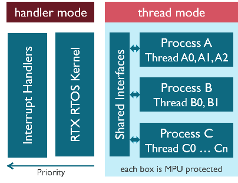
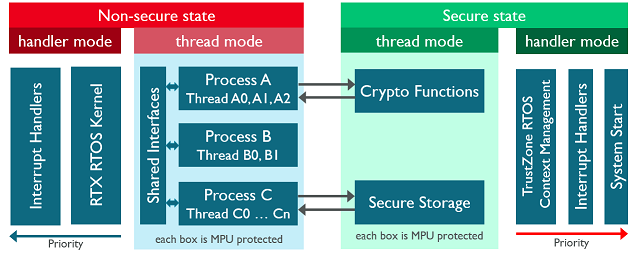
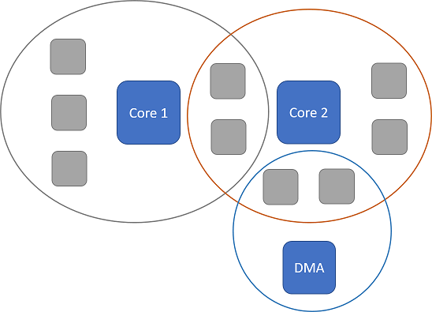

# CMSIS-Zone Use Cases {#UseCases}

**CMSIS-Zone** simplifies to manage the complexity and the configuration of modern embedded systems that frequently include multiple processors and/or memory protection hardware. It helps to split the embedded application various projects which creates the need to partition system resources. And it simplifies the consistent configuration of access rights across the system, for example when using an MPU (memory protection unit).

The following section describes several use cases that benefit from CMSIS-Zone.

## MPU Protection {#UseCase_MPU}

Focused on a single core microcontroller one might want to utilize the memory protection unit (MPU) capabilities to segregate parts of an application. Thus the need to partition the system resources accordingly arises.

## TrustZone Partitioning {#UseCase_TrustZone}

TrustZone extensions add another degree of segregation which must be handled consistently.
In this case one has to handle MPU settings per security context and SAU configuration.

## Multi-Core Partitioning {#UseCase_MultiCore}

Beside traditional single cores asymmetric and hybrid multi-core devices contribute to increasing development complexity for embedded systems. Having multiple cores running different parts of an application concurrently needs a well defined resource assignment to prevent undesired misbehavior.

