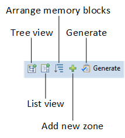

# CMSIS-Zone Utility {#zoneToolUsage}

The section describes the CMSIS-Zone Utility which is currently a stand-alone Eclipse implementation that allows you to:
 - \ref zTUIMemView "View the memory and peripheral resources" of a complete system or sub-system.
 - \ref zTUIMemAdd "Partition memory blocks" into smaller regions and define access permissions for these regions.
 - \ref zTUIPerProp "Define access permissions" for peripherals.
 - \ref zTUIPerSlotConf "Configure access rights of peripheral slots" (for example for DMA channels or I/O pins).
 - \ref zTUIZonePart "Split memory and peripheral resources into zones" (used for sub-projects or process separation in RTOS systems).
 - \ref zTUIGenerate "Generate" configuration files for tool and hardware setup, as well as
 - \ref zTUIGenerate "Generate" resource files for sub-systems that allow further partitioning.

This section describes:
 - \subpage zTInstall shows how to install the utility.
 - \subpage zTUI introduces the GUI of the CMSIS-Zone Utility.
 - \subpage zTInteractiveMode explains how to create projects and zones using the GUI.
 - \subpage zTCLI demonstrates how to work with the command line interface.
 - \subpage zTExamples contains ready-to-use projects for various devices.

\note
It is assumed that you are familiar with Eclipse and [Open-CMSIS-Packs](https://www.open-cmsis-pack.org/)
. The relevant device family packs for your target device need to be installed on your computer.

## Installation {#zTInstall}

The CMSIS-Zone utility is part of the [CMSIS-Pack Eclipse Plug-ins](https://github.com/ARM-software/cmsis-pack-eclipse/releases/latest).

Follow the instructions on the release page to install the tool.

## User Interface {#zTUI}

The CMSIS-Zone Utility user interface offers menus, toolbars, dialog boxes, and windows to manage the various aspects of your project.

The utility's GUI provides menus for selecting commands and toolbar buttons in the \ref zTGUIZoneEditor window:

### Project Explorer {#zTProjEx}

Projects that are currently available in the Eclipse workspace are shown in the **Project Explorer**. When creating a new project, you will first find the \ref rzone ".rzone" and the \ref azone ".azone" files here. Later, generator files and generated files are shown as well:

In the **Project Explorer** window, you manage the project files. The following files are shown:

| File name                      | Description                                                          |
|--------------------------------|----------------------------------------------------------------------|
| `project.azone`                | Project-level \ref azone ".azone" file                               |
| `project.rzone`                | Project-level \ref rzone ".rzone" file                               |
| `zone.azone`                   | Zone-level \ref azone ".azone" file                                  |
| `zone.rzone`                   | Zone-level \ref rzone ".rzone" file                                  |
| `*.ftl`                        | Freemarker template file used to \ref GenDataModel "generate" output |
| `helper.ftlinc`                | Helper file to generate Freemarker output                            |
| `*.sct`, `partition_*.h`       | Generated output files                                               |

### Zone Editor {#zTGUIZoneEditor}

The **Zone Editor** shows \ref azone ".azone" files in two different views: **Resource map** and **Zone map**.

The **Resource map** shows all resources available to that system or sub-system. By default, it shows the selected device, as well as lists of memories and peripherals:

The **Zone map** shows the same resources, but mapped to zones that have been created for the device:

Resources assigned to a zone are marked with colors:
| Color | Meaning |
|-------|---------|
| Green | Resource is assigned to one zone |
| Amber | Resource is assigned to multiple zones |

#### Toolbar Buttons {#zTGUIButtons}

The **Zone Editor** window contains toolbar buttons that offer direct access to functionality of the utility:

| Button                         | Description                                     |
|--------------------------------|-------------------------------------------------|
| Tree View                      | Shows the resources as a tree                   |
| List View                      | Shows the resources as a simple list            |
| Arrange memory regions         | Arranges memory regions according to their sizes |
| \ref zTUICreate "Add new zone" | Adds a new zone to the zone map                 |
| \ref zTUIGenerate "Generate"   | Generates CMSIS-Zone output files               |
